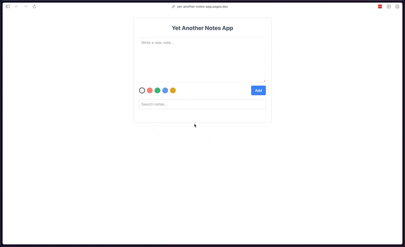

# Yet Another Notes App

This project was developed as part of the Patika Front End Bootcamp Week 10 assignment.

## About the Project

Yet Another Notes App is an interactive application that allows users to create, edit, and delete notes. Users can also filter their notes and pick colors for better organization. The app's notes are saved in local storage, ensuring persistence across sessions.

## Live Demo

You can check out the live demo of this project [here](https://yet-another-notes-app.pages.dev).

## Features

- Create and delete notes with a simple interface.
- Search functionality to filter notes by text.
- Color picker to customize note colors.
- Completed notes can be toggled for better visibility.

## Technologies Used

- React
- Tailwind CSS

