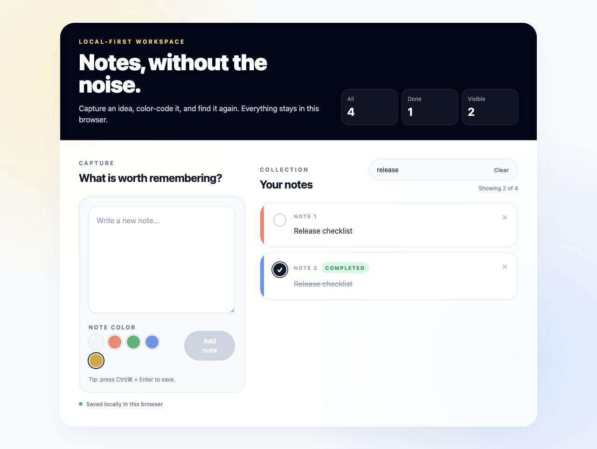
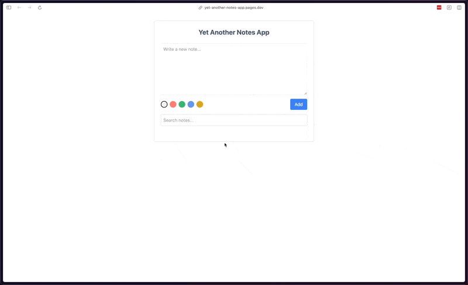

# Yet Another Notes App

This project was developed as part of the Patika Front End Bootcamp Week 10 assignment.

## About the Project

Yet Another Notes App is an interactive application that allows users to create, complete, and delete notes. Users can also filter their notes and pick colors for better organization. The app's notes are saved in local storage, ensuring persistence across sessions.

## Live Demo

You can check out the live demo of this project [here](https://yet-another-notes-app.pages.dev).



<details>
<summary>Original interaction recording</summary>



</details>

## Features

- Create and delete notes with a simple interface.
- Search functionality to filter notes by text.
- Color picker to customize note colors.
- Completed notes can be toggled for better visibility.
- Stable note identities keep filtered actions correct even when notes share the same text.
- Existing saved notes migrate automatically, while malformed browser data recovers safely.

## Verified behavior

The dependency-free rule suite covers legacy storage migration, malformed-data recovery, duplicate-ID repair, duplicate-text filtering, targeted completion/deletion, input trimming, and blank-note rejection.

### Persistence model

Notes are stored under the browser-local `notes` key as JSON objects containing a stable ID, text, completion state, and color. Loading is defensive: non-array or malformed JSON becomes an empty collection, invalid entries are discarded, whitespace is normalized, legacy entries receive IDs, and duplicate stored IDs are repaired. Filtering returns views of the same stable objects, so completing or deleting one same-text note cannot mutate its neighbor. No account, network database, analytics, or cross-device synchronization is involved.

```sh
npm ci
npm test
npm run lint
npm run build
```

## Technologies Used

- React
- Tailwind CSS
